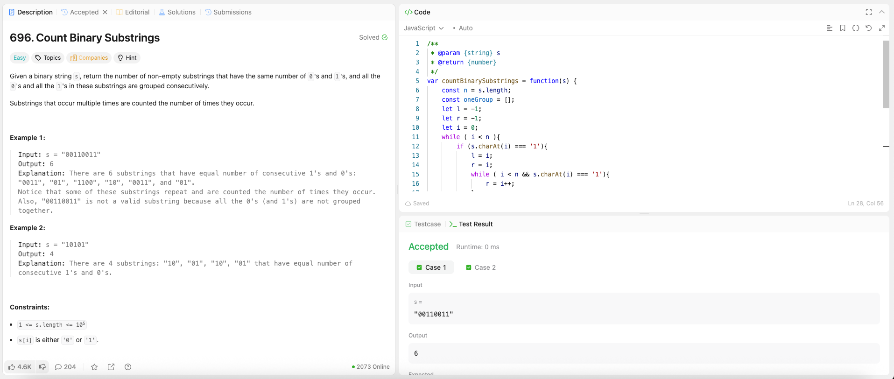

---

## 🧠 Meta

- **Problem ID:** 696
- **Difficulty:** Easy
- **Category:** Array / Binary
- **Date Solved:** 2026-02-19
- **Time Spent:** 32 minutes
- **Solved By Myself:** ✅
- **Revisit Needed:** Yes

---

## 🚧 Where I Got Stuck

- What confused me?
- What wrong approach did I try first?
- What assumption was incorrect?

---

## 💡 Key Insight

I saw the hint and then solved the problem. Recording groups of 1s, and then looking for number of 0s between the groups. But my method didn't say much about binary
