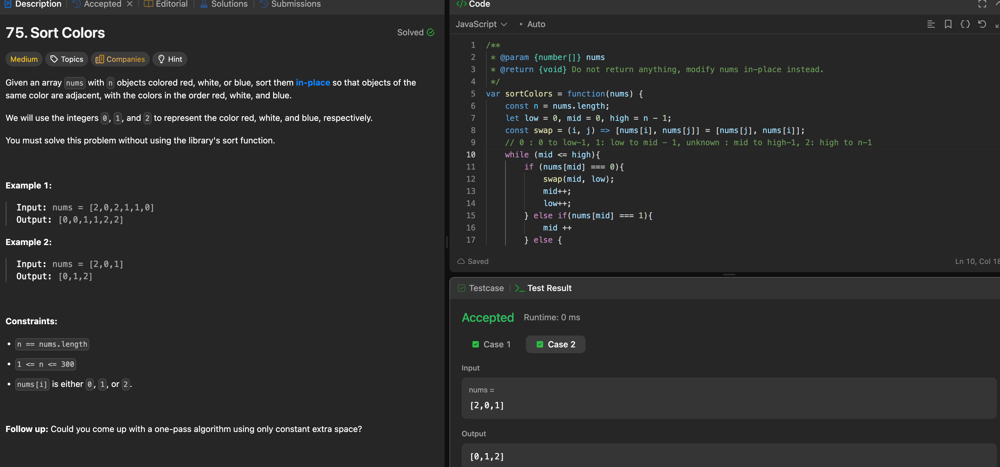

---

## 🧠 Meta

- **Problem ID:** 75
- **Difficulty:** Medium
- **Category:** Sort
- **Date Solved:** 2026-05-06
- **Time Spent:** ~19 minutes
- **Solved By Myself:** ✅
- **Revisit Needed:** Yes

---

## 🚧 Where I Got Stuck

- What confused me?
- What wrong approach did I try first?
- What assumption was incorrect?

---

## 💡 Key Insight

- I use two passes, two pointers method. Can also be solved with count sort. To solve in one pass, use the dutch national flag algorithm ( 0... low....mid...high....n-1)
