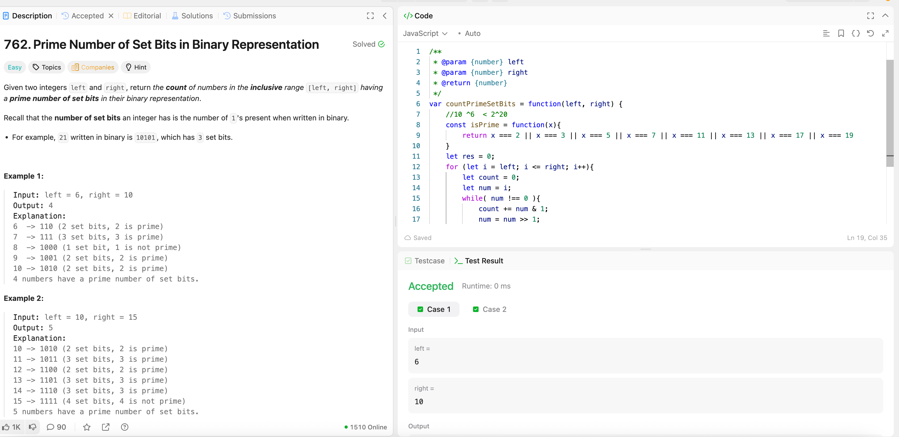

---

## 🧠 Meta

- **Problem ID:** 762
- **Difficulty:** Easy
- **Category:** Binary
- **Date Solved:** 2026-02-21
- **Time Spent:** 16 minutes
- **Solved By Myself:** ⚠️ partial
- **Revisit Needed:** Yes

---

## 🚧 Where I Got Stuck

- What confused me?
- What wrong approach did I try first?
- What assumption was incorrect?

---

## 💡 Key Insight

- Remember shifting to the right is >> and >>> for unsigned
- Do a small estimation to check for the latest prime possible. for example 10^6 < 2^20 so 19 is the biggest possible prime number.
