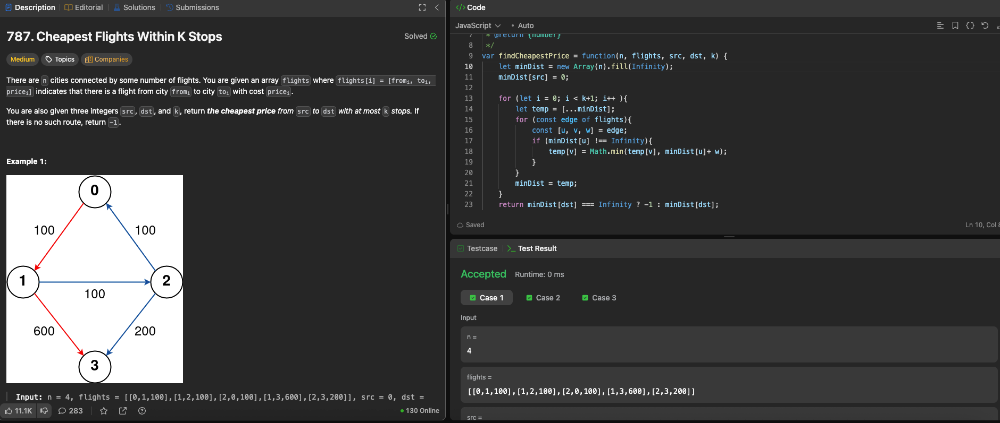

# LeetCode 787. Cheapest Flights Within K Stops

---

## 🧠 Meta

- **Problem ID:** 787
- **Difficulty:** Medium
- **Category:** Graph / BellmanFord
- **Date Solved:** 2026-02-03
- **Time Spent:** ~XX minutes
- **Solved By Myself:** ⚠️ partial
- **Revisit Needed:** Yes

---

## 🚧 Where I Got Stuck

- What confused me?
- What wrong approach did I try first?
- What assumption was incorrect? I knew when dealing with shortest distance with limited number of edges, say at most k edge, I can use bellmanFord to relax k times. But I overlooked the fact that I was using the same MinDist to update itself, which lead to using some of the updated distance in the k th relaxation to continue updating the other node's distance, which maybe using k+1 edges.

---

## 💡 Key Insight

Remember to create a hard copy of the minDist when dealing with bellmanFord with using up to k edges for shortest distance. The regular bellmanFord doesn't care about this because after n-1 relaxation, all the distance stops updating so it doesn't matter if the question doesn't ask for limited number of edges.

- Use Arrays.copy(minDist, n) / temp = [...minDist] for hard copying minDist to avoid this issue
