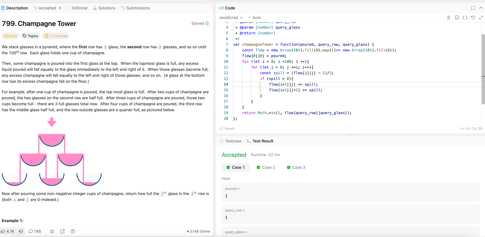

---

## 🧠 Meta

- **Problem ID:** 799
- **Difficulty:** Medium
- **Category:** simulation
- **Date Solved:** 2026-02-14
- **Time Spent:** ~XX minutes
- **Solved By Myself:** ❌
- **Revisit Needed:** Yes

---

## 🚧 Where I Got Stuck

- What confused me?
- What wrong approach did I try first?
- What assumption was incorrect?

---

## 💡 Key Insight

This problem makes me feel stupid. I thought of recursion, pascal's triangle, and checking the cups needed to fill glasses from previous rows, but all of these seems complicated.

- key insight is to calculate the amount of water that flow through each glass, and do one by one simulation.
  The spill over will be equally flowing to the glass' two children.
