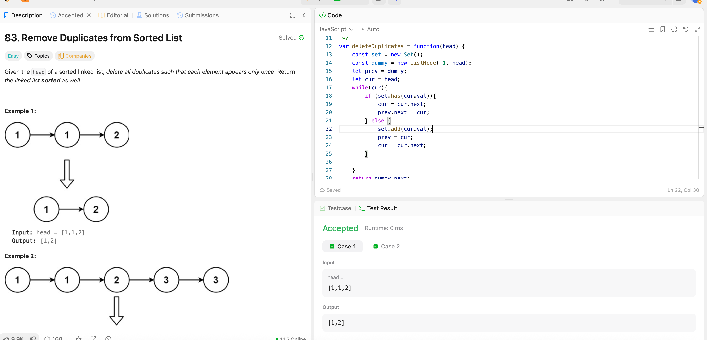

---

## 🧠 Meta

- **Problem ID:** 83
- **Difficulty:** Easy
- **Category:** LinkedList
- **Date Solved:** 2026-04-03
- **Time Spent:** ~30 minutes
- **Solved By Myself:** ⚠️ partial
- **Revisit Needed:** Yes

---

## 🚧 Where I Got Stuck

- What confused me?
- What wrong approach did I try first?
- What assumption was incorrect? in the case of repetitive node, we don't need to move the prev. I moved the prev to the current node after skipping

---

## 💡 Key Insight

The intuition is prev is always the last node we kept. So in the case of repetitive node, don't move the prev to the current node after skipping. because we don't know if we want to skip this cur node until next while loop.
