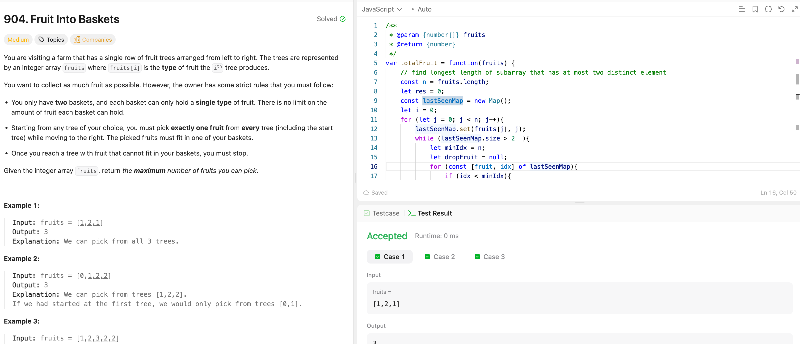

---

## 🧠 Meta

- **Problem ID:** 904
- **Difficulty:** Medium
- **Category:** Sliding window
- **Date Solved:** 2026-02-26
- **Time Spent:** ~40 minutes
- **Solved By Myself:** ⚠️ partial
- **Revisit Needed:** Yes

---

## 🚧 Where I Got Stuck

- What confused me?
- What wrong approach did I try first? I thought of using set to manage the sliding window, it's awkward and doesn't guarantee correctness, because it can't jump to the last seen idx of the fruit I wanted to drop, so I add the i+1 fruit to the set after I dropped the i th fruit. turned out to be wrong
- What assumption was incorrect?

---

## 💡 Key Insight

- The problem is finding the max length of sub array that contains at most two distinct fruits.
- The sliding window idea is correct, but instead Should use map to record each fruit's last seen index.
- When the Map size is greater than two, we find the fruit with the smallest last seen index, which can give us the longest sub array. This can be done by iterate the map entry in O(1) time. We delete that fruit from the map, keeping the window valid. Total time is O(n)
