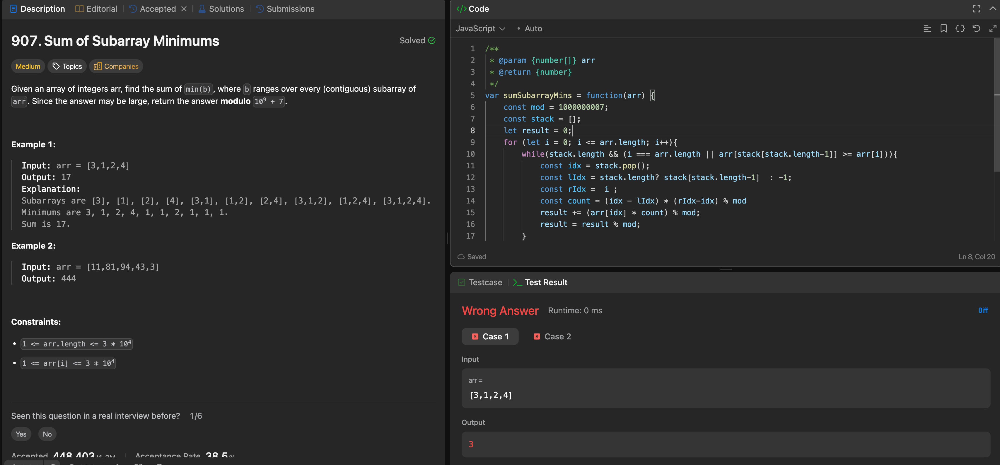

---

## 🧠 Meta

- **Problem ID:** 907
- **Difficulty:** Medium
- **Category:** Monotonic stack
- **Date Solved:** 2026-05-07
- **Time Spent:** ~50 minutes
- **Solved By Myself:** ❌
- **Revisit Needed:** Yes

---

## 🚧 Where I Got Stuck

- What confused me? Thought of DP but didn't know where to start
- What wrong approach did I try first?
- What assumption was incorrect?

---

## 💡 Key Insight

The one idea or mental model that unlocked the solution.

- Use monotonic stack, use a increasing monotonic stack, so we know what's the index of the previous smaller element.
- Remember the formula for counting the number of subarrays with the current element as the minimum.
- Need to handle duplicates consistently. when popping to get the first smaller element on the left, pops equal number to, so the left contains the duplicate when counting, and the right does not. Therefore we don't count the subarrays like [2, 2] twice.
- Do the outer for loop i to arr.length, when stack still has element at the end of the arr, we need to pop and count the number of subarrays with them as the minimum
- Be mindful of boundary. When the last element of the stack is popped, its "index for previous smaller value is -1" cuz it doesn't exist.
