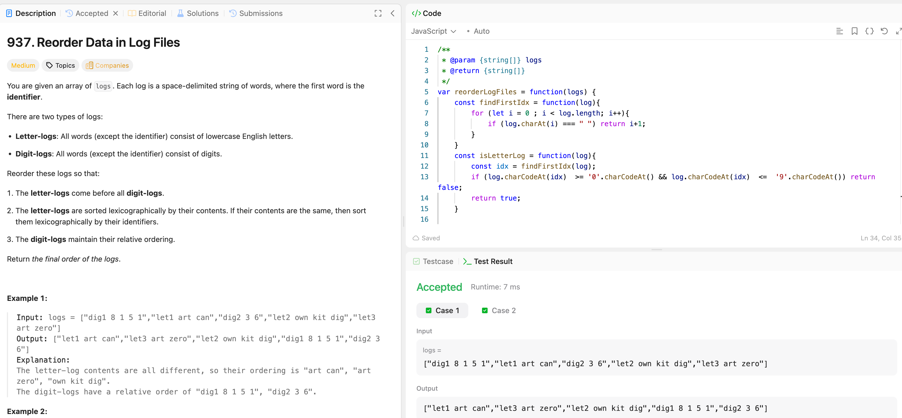

---

## 🧠 Meta

- **Problem ID:** 937
- **Difficulty:** Medium
- **Category:** String / Array
- **Date Solved:** 2026-02-27
- **Time Spent:** ~18 minutes
- **Solved By Myself:** ⚠️ partial
- **Revisit Needed:** Yes / No

---

## 🚧 Where I Got Stuck

- What confused me?
- What wrong approach did I try first? I used the sort on string simply as a - b
- What assumption was incorrect?

---

## 💡 Key Insight

- For js, sorting for string need to use a.localeCompare(b). a-b will gives Nah
