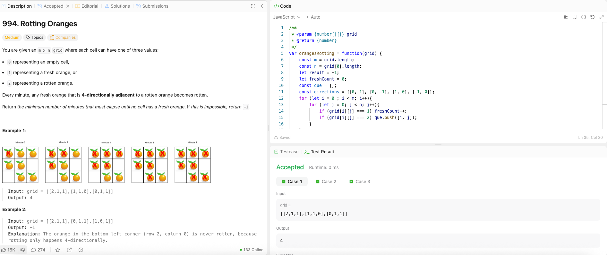

---

## 🧠 Meta

- **Problem ID:** 994
- **Difficulty:** Medium
- **Category:** Graph
- **Date Solved:** 2026-02-20
- **Time Spent:** ~31 minutes
- **Solved By Myself:** ⚠️ partial
- **Revisit Needed:** Yes

---

## 🚧 Where I Got Stuck

- What confused me?
- What wrong approach did I try first? Thought of trying BFS from every rotten, and get the min. Which is incorrect
- What assumption was incorrect?

---

## 💡 Key Insight

The BFS should be starting off with all the rotten at the beginning. Use delimiter [-1, -1], push it to the queue to signal the end of one level. And when we poll the delimiter, time++. Adding delimiter only when there's still element inside the queue to avoid infinite loop
